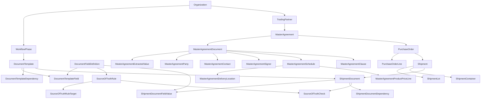

# Agora Architecture

Agora is a Rails 8 application for export-document workflow orchestration. The
core design has three layers:

- **Template layer**: organization-owned definitions of what the export workflow
  should require.
- **Contract packet/extraction layer**: uploaded master agreement PDFs,
  extracted contract terms, human review state, and normalized schedule data.
- **Runtime layer**: operational buyer, contract, purchase order, shipment, and
  shipment document records created during real work.

This split lets each organization configure its expected document graph once,
extract contract terms into reviewed source data, then instantiate that graph
repeatedly for shipments.

## System Shape



## Template Layer

The template layer is seeded for every organization by `SeedWorkflowTemplates`.
It defines:

- `WorkflowPhase`: ordered workflow sections such as booking, loading, customs,
  and post-shipment collection.
- `DocumentTemplate`: reusable document definitions, including type,
  obligation, criticality, destination filters, generator roles, receiver roles,
  and grain.
- `DocumentTemplateDependency`: directed prerequisite edges between templates.
- `DocumentFieldDefinition`: reusable field keys such as consignee, incoterm,
  net weight, container number, and invoice amount.
- `DocumentTemplateField`: fields required by each document template.
- `SourceOfTruthRule`: which template is authoritative for a field.
- `SourceOfTruthRuleTarget`: which templates should be checked against that
  authoritative value.

Template records belong to an organization and are managed primarily through
Avo.

## Runtime Layer

The runtime layer follows the operational hierarchy:

```text
TradingPartner
  -> MasterAgreement
      -> PurchaseOrder
          -> Shipment
              -> ShipmentDocument
```

`MasterAgreement#contract_file` exists for backward compatibility. New source
PDFs should be attached through `MasterAgreementDocument` in the contract packet
layer.

Additional runtime children support the document grains defined in the template
layer:

- `PurchaseOrderLine` supports `sku_producto` templates.
- `ShipmentLot` supports `lote` templates.
- `ShipmentContainer` supports `contenedor` templates.
- `ShipmentDocumentFieldValue` stores values for runtime documents.
- `ShipmentDocumentDependency` stores runtime prerequisite edges.
- `SourceOfTruthCheck` stores runtime consistency results.

All operational models are organization-owned and use `acts_as_tenant` where
appropriate. Critical models also use PaperTrail.

## Contract Packet And Extraction Layer

Master agreement packets are first-class app data. They are not only file
attachments.

`MasterAgreementDocument` stores source PDFs and extraction metadata:

- `document_kind`: `agreement`, `schedule`, `exhibit`, or `certificate`;
- Active Storage `file`;
- extraction status, error, extracted text, and raw extracted JSON;
- DocuSign envelope status, subject, originator, and time zone;
- optional effective/expiration dates and review metadata.

Normalized extraction records hang off the agreement/document:

- `MasterAgreementExtractedValue` for field-level output with provenance,
  confidence, and review state;
- `MasterAgreementParty`, `MasterAgreementContact`, and
  `MasterAgreementSigner` for counterparties, notice/emergency contacts, and
  DocuSign execution facts;
- `MasterAgreementSchedule`, `MasterAgreementDeliveryLocation`, and
  `MasterAgreementProductPriceLine` for schedule terms, designated locations,
  and image/table-derived pricing rows;
- `MasterAgreementClause` for clause summaries and obligations.

Extraction is intentionally review-gated. AI output starts as `pending_review`.
Only `confirmed` records can become operational source data.

The main services are:

- `ContractExtraction::PdfContent`: downloads the Active Storage PDF, extracts
  text with `pdf-reader`, and adds sparse page images for image-only pages when
  `pdftoppm` is available.
- `ContractExtraction::AiClient`: posts a provider-agnostic JSON payload to
  `MASTER_AGREEMENT_EXTRACTION_ENDPOINT`.
- `ContractExtraction::ExtractMasterAgreementDocument`: persists the raw JSON
  and normalized packet records.
- `ContractExtraction::SyncReviewedValues`: copies confirmed contract terms into
  `MasterAgreement` attributes and agreement-level
  `ShipmentDocumentFieldValue` records.

See `docs/master-agreement-extraction.md` for the detailed contract extraction
workflow and payload expectations.

## Workflow Generation

`CreateShipmentWorkflow.call(shipment)` instantiates active document templates
for a shipment workflow. The service is idempotent and safe to call multiple
times.

Document template grain maps to runtime object as follows:

| Template grain | Runtime documentable |
|---|---|
| `relacion_comercial` | Shipment purchase order's `MasterAgreement` |
| `po` | Shipment `PurchaseOrder` |
| `sku_producto` | Shipment purchase order's `PurchaseOrderLine` records |
| `embarque` | `Shipment` |
| `lote` | `ShipmentLot` records |
| `contenedor` | `ShipmentContainer` records |
| `set_documentario` | `Shipment` |

Generation is triggered when a shipment is created. Adding lots or containers
also refreshes the workflow so child-grain documents are created.

The workflow service also:

- skips inactive templates;
- applies template destination filters;
- includes `marine_insurance` only for CIF shipments;
- creates `relacion_comercial` documents once per master agreement and reuses
  them across all purchase orders and shipments under that agreement;
- creates blank runtime field values for configured template fields;
- pre-fills unambiguous scalar values from operational records and confirmed
  contract extraction data;
- builds runtime dependency edges from template dependencies;
- recalculates runtime document and shipment status.

## Dependency And Status Lifecycle

`BuildShipmentDocumentDependencies.call(shipment)` converts
`DocumentTemplateDependency` records into `ShipmentDocumentDependency` records.

For Phase 2, every dependent document instance depends on every prerequisite
document instance for the prerequisite template.

`RecalculateShipmentDocumentStatus.call(shipment_document)` updates runtime
dependency edges and document status:

- prerequisite approved or waived -> dependency becomes `satisfied`;
- open prerequisite -> dependent document remains `blocked`;
- no open prerequisites -> dependent document becomes or remains `pending`;
- approved, waived, and rejected documents are terminal for recalculation.

Shipment status is derived from required document readiness unless the shipment
is already in a terminal operational state.

## Source-Of-Truth Validation

`ValidateShipmentSourceOfTruth.call(shipment)` applies `SourceOfTruthRule`
records to runtime shipment documents.

For each rule, Agora compares the authoritative document field value with the
target document field value and persists a `SourceOfTruthCheck`:

- `matched`: expected and actual values are equal.
- `mismatch`: expected and actual values differ.

Phase 2 does not auto-correct target document values. Checks are persisted so
operators can review inconsistencies and decide the appropriate correction.

The current seed catalog includes source-of-truth checks for confirmed contract
terms such as payment terms, delivery terms, and delivery locations in addition
to shipment quantities, weights, parties, HS/product descriptions, container
data, and invoice amount.

## Tenant Boundary And Authorization

Tenant routes live under `/:org_slug`. `ApplicationController` sets
`Current.organization` from the path and verifies that the signed-in user belongs
to that organization.

Authorization uses Pundit policies backed by the app's RBAC model:

- `Permission(resource, action)` is the permission catalog.
- `Role` belongs to an organization and has many permissions.
- `User` belongs to an organization and role.
- `user.can?(resource, action)` checks assigned role permissions.

Avo lives at `/admin` and is for superadmin/backoffice access. It uses its own
layout and must not include the app's Vite assets.

## Frontend Boundary

The product UI uses Inertia + React. Phase 2 tenant UI is intentionally narrow
and contract-first:

- master agreement index;
- master agreement detail with contract packet upload/extraction/review,
  purchase orders, shipments, shared agreement-level workflow documents,
  schedules, contacts, delivery locations, pricing rows, and clauses;
- shipment detail/checklist from inside the contract hierarchy;
- document approve/waive actions;
- source-of-truth validation trigger.

Creation and editing of trading partners, agreements, purchase orders,
shipments, lots, and containers is Avo-first in Phase 2. Tenant UI copy is
currently mixed English/Spanish; new screens should keep terminology consistent
with the surrounding page until the product has a formal localization pass.

## Verification

Use:

```bash
bin/rails db:migrate
bin/rails test
npm run build
```

The application expects Ruby 3.3.x. On this machine, Homebrew `ruby@3.3` is
linked so plain `bin/rails` commands use a Rails-compatible runtime.
